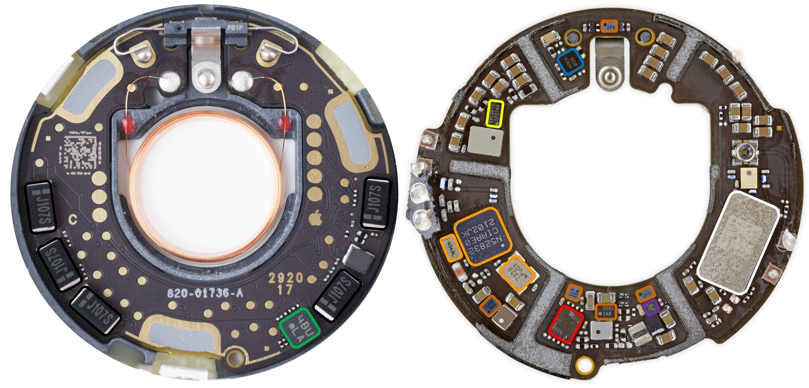
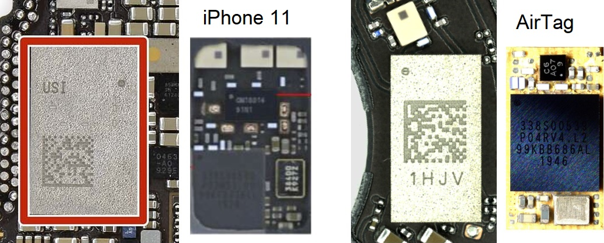
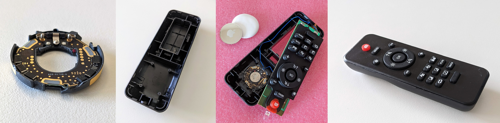
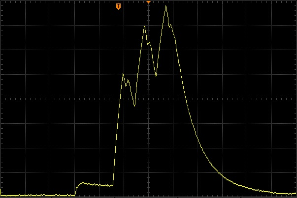
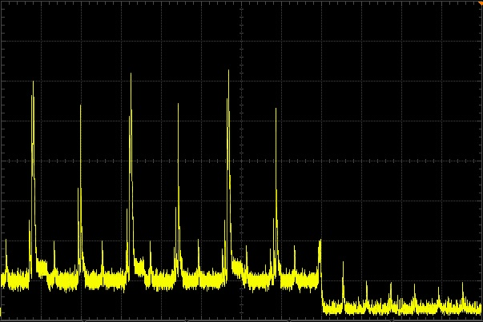

# Apple AirTag Reverse Engineering

This page serves as a central resource for technical details of the AirTag: hacks, security research, modifications, teardowns and more. It is a combination of my work and publicly available information. It will be updated as more is discovered.

Skip to: [Security](#security-issues), [Privacy](#privacy-concerns), or [Hardware](#hardware).

[Tweet me](https://twitter.com/adamcatley) or [view on GitHub](https://github.com/adamcatley/adamcatley.github.io/blob/master/docs/AirTag.md) to propose changes or corrections.


## Key Facts and Findings

- Uses **off the shelf** components, apart from Apple's U1 chip for UWB
- The popular **nRF52832** is used for BLE and NFC
- Sleep current consumption of **2.3µA** gives over **10 years** of potential battery life
- Updates BLE address and public key **once a day** at 04:00am
- Updates last byte of advertisement data every **15 minutes**
- Goes into a lost mode exactly **3 days** after being away from its owner's device
- Makes noise once every **6 hours** while in lost mode and movement is detected
- Samples the accelerometer every **10 seconds** when waiting for movement
- Samples the accelerometer every **0.5 seconds** once motion is detected, for **20 seconds**
- Transmits BLE advertisement every **2 seconds** when away from its owner's device
- BLE connection interval of **1 second** when near its owner's device
- nRF needs at least **~1.9V** battery voltage to boot up
- 32Mbit flash storage is **unencrypted**
- nRF programming interface (**SWD**) easily accessible via test pads and can be unlocked

## Background

I started this investigation to learn about Apple's approach to electronics design and security in their latest products, especially at such a low price point ($29). I was particularly interested due to the similarities to my [Masters thesis](https://drive.google.com/file/d/0By4g-wZWsMlnaGg5S2JNRXRNWkk/view?usp=sharing) project in which I designed a small BLE device where battery life was also important.

The aspects that I wanted to investigate are:
- Hardware design to fit so much in a small enclosure (BLE, UWB, NFC, accelerometer, speaker, antennas) - [results](#hardware)
- Use of custom silicon vs "off the shelf" components - [results](#pcb-overview)
- Low energy design of hardware and software to maximise battery life - [results](#battery-life)
- Implementation of the [claimed privacy](#privacy-claims) features to avoid unwanted tracking - [results](#privacy-concerns)
- Usage of recent BLE privacy and security features - [results](#bluetooth)
- Hardware and firmware security of Apple products - [results](#security-issues)
- What modifications are possible - [results](#mods)

### FindMy Service Overview
Apple document the privacy features of the FindMy network, including end to end encryption in detail [here](https://support.apple.com/en-gb/guide/security/sec60fd770ba/web) and [here](https://support.apple.com/en-gb/guide/security/sece994d0126/web).

[](https://support.apple.com/en-gb/guide/security/sece994d0126/web)


### Supported devices

Support for the AirTag was introduced in iOS 14.5. Apple lists which iPhone, iPod Touch and iPad devices are supported [here](https://support.apple.com/en-gb/HT211348).

<!--
### Existing trackers

TODO

-->

<!---
## Theory of Operation

TODO

### Architecture

TODO

--->

## Software

### Operating States

I will try to make this into a state flow diagram soon. For now, these are the main states the AirTag can be in:

- **Not registered**: When the AirTag is brand new, has been [reset](https://support.apple.com/en-gb/HT212251#:~:text=repeat%20the%20process%20four%20more%20times,%20removing%20and%20replacing%20the%20battery), or has been [removed](https://support.apple.com/en-in/guide/iphone/iph869abb075/ios) from the FindMy network. Waits to be connected to while advertising itself every 33ms.
- **Initialisation**: The AirTag is being registered to an Apple ID and a public/private key pair is generated and shared between the AirTag and the connected iOS device.
- **Connected**: The owner's device is in range. No broadcasts occur.
- **Disconnected**: The owner's device is out of range. Broadcasts identity every 2000ms.
- **Out of sync**: Happens when an AirTag reboots while separated from its owner's device. Acts like `Disconnected` but absolute time is lost so events are relative to time since power-up. Identity resets to initial value.,
- **Lost**: Occurs 3 days after `Disconnected` or `Out of sync` begin. Moves to `Waiting for motion` every 6 hours.
- **Waiting for motion**: Samples the accelerometer every 10 seconds until motion is detected.
- **Sound alert**: A command to play a noise is received from either a connected device or by detecting motion. Lasts a maximum of 20 seconds.
- **Precision finding**: Triggered by the owner's device while in `Connected`. Is overridden by `Sound alert`

## Hardware 

[](https://twitter.com/adamcatley/status/1388196843184697346)

### Teardown

There are several documented teardowns, listed in chronological order:

- [Apr 30] My own [Twitter thread](https://twitter.com/adamcatley/status/1388196843184697346), [@haruki_kawaiii](https://twitter.com/haruki_kawaiii/status/1388012416613507072), [DBrand](https://dbrand.com/shop/special-edition/teardown) skins ([front](https://dbrand.com/sites/default/files/dba/printed-skins-ppv/teardown/apple-airtag/sig_teardown-gloss_0.jpg), [back](https://dbrand.com/sites/default/files/dba/printed-skins-ppv/teardown/apple-airtag/sig_teardown-gloss_1.jpg) images)
- [May 3] [iFixit](https://www.ifixit.com/News/50145/airtag-teardown-part-one-yeah-this-tracks) article (inlcuding x-ray [video](https://valkyrie.cdn.ifixit.com/media/2021/05/01153224/drill-xray-1.mp4) and high  quality [front](https://valkyrie.cdn.ifixit.com/media/2021/05/03133827/AirTags_33.jpg), [back](https://valkyrie.cdn.ifixit.com/media/2021/05/03133839/AirTags_48.jpg) images), [@tb69rr](https://twitter.com/tb69rr/status/1389183123234119680)
- [May 4] [JerryRigEverything](https://www.youtube.com/watch?v=5MaPqUYAetg) video
- [May 7] Colin O'Flynn [Twitter thread](https://twitter.com/colinoflynn/status/1390432081126297606) and related [blog post](https://colinoflynn.com/2021/05/apple-airtag-teardown-test-point-mapping/)

Note: Removing the PCB is likely to cause damage due to the thin PCB and being soldered to the plastic tray.

There are also teardowns of alternative tracking devices with similar hardware, such as the Samsung [SmartTag](https://twitter.com/LucaBongiorni/status/1392109083998752776) and [SmartTag+](https://twitter.com/LucaBongiorni/status/1392106994958483463).

#### Revisions

The various teardowns reveal variations in the PCB markings in the top copper layer. This will be useful if it is determined that early production runs didn't enable all security features to lock down the units.

The bottom right numbers look like a manufacturing data code (eg. "2920 17" could be the 29th week of 2020, batch 17). From the available samples:
- US devices are in the range `2920, 3020, 3120`
- Europe is `5220`, a few months later
- Asia is `1021`, a few months later and only a few weeks before launch

There is also a letter to the left of the 3 big pads on the left. This could relate to the U1 chip underneath. This is either `A` and a 3 digit number (Europe) or `C` (rest of world).

A constant value `820-01736-A` is on the silkscreen layer and looks like Apple's internal part number and revision (`A`) for the PCB.

### PCB Overview



    🟠 Nordic nRF52832 SoC with BLE and NFC, plus 32MHz and 32.768kHz crystals
    ⚪ Apple U1 UWB Transceiver
    🔴 GigaDevice GD25LE32D 32Mbit NOR flash
    🟢 Bosch BMA280 accelerometer
    🔵 Maxim MAX98357AEWL audio amplifier
    🟡 TI TPS62746 DC-DC buck converter
    🟣 TI TLV9001IDPWR opamp
    ⚫ 100uF Electrolytic Capacitors (5x)
    🟤 Unknown. Unable to decode markings


#### Test points

[](https://github.com/colinoflynn/airtag-re/blob/master/images/frontside-tpnames.jpg)

*Colin O'Flynn has helpfully [documented](https://github.com/colinoflynn/airtag-re/blob/master/README.md) the test points on the top side of the PCB.*

TP#|Type|Description
-|-|-
1|Speaker|One end of the voice coil
5|Power|VCC2 in (3V)
6|Power|VCC1 in (3V)
7|Power|GND
19|Flash|Data in
20|Flash|Data out
21|Flash|VCC (1.8V) supply for Flash
22|Flash|SCLK
23|Flash|CS
29|Power|GND (Apple Logo)
30|nRF|nRST
31|Debug|SWO
35|Debug|SWCLK
36|Debug|SWDIO
38|Speaker|The other end of the voice coil


### Antennas

There are three antennas inside the AirTag:

1. Bluetooth Low Energy (left) - 2.4GHz
2. NFC (middle) - 13.56MHz
3. Ultra-Wideband (right) - 6.5-8GHz


They are all etched onto a single piece of plastic using Laser Direct Structuring (LDS) and then soldered to the PCB around the edge. The NFC antenna also has a short trace on the other side of the plastic (connected with a via at each end) to return the inside end of the coil to the PCB.

### Speaker

The voice coil is glued to the outer plastic shell which acts as a diaphragm. Due to the fixed magnet, it moves back and forth when the coil is energised, producing sound to act as the speaker.

The AirTag operates the same whether the voice coil is connected or not.

After 3 days of being away from its owner's device, the speaker will make a loud beep if motion is detected, for a maximum of 20 seconds of motion. It will then stay silent for the next 6 hours until waiting for motion again.

Playing sound uses >3000x more power than being asleep, around 8mA, even without a voice coil attached. This is perhaps because the nRF has to rapidly update the DAC with audio samples. Here current (yellow) is plotted in sync with the corresponding sound wave (blue) while playing the lost AirTag noise:


### Flash storage

The SPI flash can be accessed by following [this guide](https://colinoflynn.com/2021/05/apple-airtag-teardown-test-point-mapping/).

<!--### Accelerometer-->

### Power

There are 2 positive battery terminals. Both need 3V applied to boot the AirTag.

However, only the left side battery terminal powers the electronics. The voltage on the right-side terminal is sensed but consumes only ~50nA in all modes. 

There are 5 100uF capacitors around the edge of the top side of the PCB. They keep the device powered up for several seconds with the battery removed. This likely helps with the [reset procedure](https://support.apple.com/en-gb/HT212251#:~:text=repeat%20the%20process%20four%20more%20times,%20removing%20and%20replacing%20the%20battery) of removing the battery 5 times in short succession.

The AirTag does not retain the current time after a power cycle until it reconnects to its owner device.

### Bluetooth LE

The nRF52832 supports BLE 5.2 and has a single 2.4GHz antenna. A Nordic SoftDevice is used to implement the BLE stack, likely [S112](https://infocenter.nordicsemi.com/index.jsp?topic=%2Fug_gsg_ses%2FUG%2Fgsg%2Fsoftdevices.html).

#### Advertising data

This section describes the Bluetooth activity when the AirTag is registered to the FindMy network. 

- Address type: Random Static (changes daily, first 6 bytes of public key)
- Advertising PDU type: Connectable undirected (ADV_IND)
- Advertising period: 2000ms
- Advertising transmit time: 4ms (including wake up)

Byte #|Value|Description
:-:|-|-
0|0x1E|Advertising data length: 31 (the maximum allowed)
1|0xFF|Advertising data type: Manufacturer Specific Data
2-3|0x004C|Apple's [company identifier](https://www.bluetooth.com/specifications/assigned-numbers/company-identifiers/)
4|0x12|Apple payload type to indicate a FindMy network broadcast
5|0x19|Apple payload length (31 - 6 = 25 = 0x19)
6|0x10|Status byte
7-29|Varies|EC P-224 public key used by FindMy network. Changes daily
30|0-3|Upper 2 bits of first byte of ECC public key
31|Varies|Crypto counter value? Changes every 15 minutes to a random value

According to Apple's [documentation](https://support.apple.com/en-gb/guide/security/sece994d0126/1/web/1#:~:text=P-224%20public%20key%20Pi%20obtained%20from%20the%20Bluetooth%20payload), the BLE advertising data contains a NIST EC P-224 public key. This key would be at least 28+1 bytes long but only 23+1 bytes in the advertising data ever change. The other 6 bytes are cleverly used as the device's Bluetooth address. This is how Apple fits a public key in a single BLE packet. As demonstrated [here](https://github.com/seemoo-lab/openhaystack/blob/ffc5170ea4b4ceb1ad84e4f89324d6e666ffc7c3/Firmware/ESP32/main/openhaystack_main.c#L107).

There also seems to be a way to predict part of the future Bluetooth address, but this needs more investigation.

Apple presumably uses authentication to stop non-Apple devices connecting to the AirTag, as connections are terminated by the AirTag shortly after connecting.

#### Unregistered behaviour

When the AirTag is not registered to the FindMy network, it has similar behaviour but advertises using its default device address at 33ms intervals, and with a different Apple payload. 

Byte #|Value|Description
:-:|-|-
0|0x1E|Advertising data length: 31 (the maximum allowed)
1|0xFF|Advertising data type: Manufacturer Specific Data
2-3|0x004C|Apple's [company identifier](https://www.bluetooth.com/specifications/assigned-numbers/company-identifiers/)
4|0x07|Apple payload type to indicate a FindMy device?
5|0x19|Apple payload length (31 - 6 = 25 = 0x19)
6-31|Varies|Not investigated yet

### UWB

Precision Finding uses Ultra-Wideband communication with Apple's U1 and a single antenna. Very little is known about this custom chip designed by Apple.

It likely contains a processor as the flash chip [contains](https://twitter.com/ghidraninja/status/1390609884316635138) 64-bit ARM instructions that the nRF52832 does not support.



The U1 is inside a module marked USI (AirTag module marking is visible [here](https://twitter.com/ghidraninja/status/1392422851127414785/photo/1)). The package in the AirTag looks different to what is seen in other Apple devices such as the [iPhone 11](https://www.ifixit.com/News/33257/inside-the-tech-in-apples-ultra-wideband-u1-chip). 

[Left](https://www.eetimes.com/iphone-11-watch-5-whats-new-whats-dropped/#:~:text=UWB%20module) is inside the USI module of the iPhone 11. [Right](https://siliconpr0n.org/archive/doku.php?id=h1kari:apple:u1) is inside the smaller module of the AirTag, which lacks a front end and the antenna balun (which is now on the PCB). The U1 can be seen as the black square chip in both modules with several lines of markings The U1 die [photo](https://siliconpr0n.org/archive/doku.php?id=h1kari:apple:u1#:~:text=Die) for both show the same marking `TMKA75`.

From the FCC [test report](https://fccid.io/BCGA2187/Test-Report/12791034-E2V3-FCC15-519-Final-Report-5130980):
- UWB Channel 5 (6.5GHz) and 9 (8GHz)
- 500MHz Bandwidth
- BPSK modulation
- 1 antenna [(above)](#antennas)

Testing the Precision Finding feature gives the impression that UWB is only used to measure distance to the AirTag, not direction. The AirTag simply transmits pulses every ~60ms from its single antenna. Multiple antennas are needed on either the receiver or transmitter in order to measure direction from phase distances. BLE 5 supports this with [AoA and AoD](https://www.bluetooth.com/blog/new-aoa-aod-bluetooth-capabilities/).

### NFC

The AirTag uses the [NFC-A peripheral](https://infocenter.nordicsemi.com/index.jsp?topic=%2Fcom.nordic.infocenter.nrf52832.ps.v1.1%2Fnfc.html) of the nRF52832 to implement an NXP MIFARE Plus (Type 4) tag in read-only mode.  The NFC antenna is located behind the white cover, as shown [above](#antennas).

NFC is used to allow anyone who finds an AirTag to potentially identify the owner, even if they have an Android device. Apple describes the process [here](https://support.apple.com/en-gb/HT212227#:~:text=If%20you%20find%20an%20AirTag%20or%20a%20lost%20item%20with%20an%20AirTag%20attached).

The tag can only be read when the AirTag is powered by a battery. It simply contains a URL to uniquely identify the AirTag, depending on its current state.

#### Unregistered
When the AirTag is brand new, has been [reset](https://support.apple.com/en-gb/HT212251#:~:text=repeat%20the%20process%20four%20more%20times,%20removing%20and%20replacing%20the%20battery), or has been [removed](https://support.apple.com/en-in/guide/iphone/iph869abb075/ios) from the FindMy network, the URL stored on the tag is fixed and the values do not change. It follows the following format:

```
https://found.apple.com/airtag?pid=5500&b=00&pt=004c&fv=00100e10&dg=00&z=00&bt=A0B1C2D3E4F5&sr=ABCDEF123456&bp=0015
```

Parameter | Value | Description
:-:|-|-
pid|5500|Product ID for AirTag?
b|00|Battery related?
pt|004c|UWB Precision tracking/Finding version?
fv|00100e10|Firmware version?
dg|00|Diagnostic code?
z|00|Unknown
bt|XXXXXXXXXXXX|Default Bluetooth address (hexadecimal)
sr|XXXXXXXXXXXX|Serial number of tag (alphanumeric)
bp|0015|Bluetooth protcol version?

While this data uniquely identifies the AirTag, it uses identifiers you would have access to if you were near enough to read NFC (<10cm) before the device is registered:
- The device's Bluetooth address `bt` is also used for broadcasts in this state (so could be captured by someone nearby during setup). 
- The serial number `sr` is not a secret. It is printed on the device under the battery (and on a sticker on the device packaging). It is also revealed by visiting the URL itself. Apple explain this [here](https://support.apple.com/en-gb/HT211658).

Apple's servers accept any combination of values and parameter names. The only one used is `sr` and it can be empty. See [here](https://found.apple.com/airtag?sr=).
```
https://found.apple.com/airtag?sr=
```

I don't yet have another AirTag to compare the values across different devices. For a single unit, the values are persistent across power cycles, long runtime, resets and modes.

#### Registered

When the AirTag has been registered to the FindMy network with an iOS device, the tag URL changes slightly to the following format:

```
https://found.apple.com/airtag?pid=5500&b=00&pt=004c&fv=00100e10&dg=00&z=00&pi=793f8d9fccaa91c3c177f32acf47160656873168d72f070cd925ce97
```

Parameter | Value | Description
:-:|-|-
pid|5500|Product ID for AirTag?
b|00|Battery related?
pt|004c|UWB Precision tracking/Finding version?
fv|00100e10|Firmware version?
dg|00|Diagnostic code?
z|00|Unknown
pi|Varies |Public identity (224 bits long)

In summary, the parameters `bt`, `sr` and `bp` have been removed and replaced with a single **anonymous** identifier, `pi` (not to be confused with `pid`).

`pi` is the only parameter that changes. It is updated at least every 15 minutes when the Bluetooth address and/or the advertising data changes. It is likely the current P-224 public key, or a SHA-224 hash of the key. It does not match the BLE advertising data which should contain the public key.

Again, most parameters are optional. The only requirement is that `pi` is valid. 

Apple servers can somehow connect this to a specific device as the page shows the corresponding serial number (maybe even before the AirTag has been registered) as well as the owner's lost message and phone number if available. Apple claims to not store any information about the AirTags and only the owner's phone and the AirTag can generate their rotating public keys.

The firmware function that generates this URL has been [identified](https://twitter.com/ghidraninja/status/1390639514134237186) by [@ghidraninja](https://twitter.com/ghidraninja). Further reverse engineering could reveal the meaning of the unknown URL parameters set by that function.

[](https://twitter.com/ghidraninja/status/1390639514134237186)

## Privacy Concerns

While it is possible to use other products similar to AirTag to track people, they cannot benefit from the unmatched global coverage of the FindMy network. This makes the AirTag a more appealing device to people with malicious intent and so privacy features are important.

Let's look at how reality compares to the claims Apple makes about the AirTag privacy features when the known [security issues](#security-issues) are considered.

1.  **Sound alerts are infrequent and unlikely**

    >*"When moved, any AirTag separated for a period of time from the person who registered it will make a sound to alert those nearby"* - [Source](https://support.apple.com/en-us/HT212227#:~:text=any%20AirTag%20separated%20for%20a%20period%20of%20time%20from%20the%20person%20who%20registered%20it%20will%20make%20a%20sound%20to%20alert%20those%20nearby)

    **Reality**: Sound alerts don't start until three days after separation. Even then, they only happen once motion is detected, for a maximum of 20 seconds of detected motion. The AirTag is then silent for 6 hours at a time between waiting for motion to make a sound for a maximum of 20 seconds. 

    **Impact**: An AirTag unknowingly placed in someone's possessions can be used to track them for at least 3 days, enough to identify their routine. After that, it is likely to make noise for a maximum of 40 seconds a day during a normal commuting schedule (2 motion triggers >=6 hours apart). Movement is likely to coincide with a noisy environment while travelling or muffled by objects touching the white casing.

    **Solution**: More frequent/randomised checks for sound events that last longer, or wait for motion to stop to increase the chance of it being heard. Apple has [suggested](https://daringfireball.net/linked/2021/04/20/moren-fine-print) this period can be adjusted.

1.  **Speaker can be disabled**

    >*"An AirTag that isn't with the person who registered it for an extended period of time will also play a sound"* - [Source](https://support.apple.com/en-us/HT212227#:~:text=An%20AirTag%20that%20isn't%20with%20the%20person%20who%20registered%20it%20for%20an%20extended%20period%20of%20time%20will%20also%20play%20a%20sound)

    **Reality**: The coil can be disconnected without disassembly. The AirTag operates as normal without the voice coil connected. I have observed all sound related events still occur, just silently. Further, the magnet can be removed instead, if the AirTag is updated to check for an open circuit. 

    **Impact**: An attacker can easily modify an AirTag and be unknowingly placed in someone's possessions to track a target's location without them being audibly notified of its presence.

    **Solution**: Use the accelerometer to measure the vibration that should be caused by the loud sound, or add a microphone.

1.  **Location can be tracked for the whole day**

    >*"Bluetooth signal identifiers transmitted by AirTag rotate frequently to prevent unwanted location tracking"* - [Source](https://www.apple.com/uk/newsroom/2021/04/apple-introduces-airtag/#:~:text=Bluetooth%20signal%20identifiers%20transmitted%20by%20AirTag%20rotate%20frequently%20to%20prevent%20unwanted%20location%20tracking.)
    
    >*"Identifiers rotate several times per day"* - [Source](https://youtu.be/DEbm2iG1TNU?t=117)

    **Reality**: The Airtag changes the identity it broadcasts once per day, at 04:00AM local, when it is separated from its owner's device. Alternatively, it changes once every 24 hours after a power cycle occurs. Apple requires Bluetooth accessories to change their identity every 15 minutes, including other FindMy devices. However, AirTag only updates the last byte of its BLE advertisement data. The BLE device address, and public key, remain static until the next day. Note: AirTag only starts broadcasting when it is away from its owner's device, with a new identity generated upon disconnection.

    **Impact**: An AirTag user can be uniquely identified and tracked, by anybody within Bluetooth range, for the remainder of the day. This is likely to include going to their home.

    **Solution**: Update the public key more frequently than every 24 hours, but less often than every 15 minutes so that the "AirTag Found Moving With You" alert is still possible.

1.  **Location can be spoofed**

    >*"If AirTag is separated from its owner and out of Bluetooth range, the Find My network can help track it down."* - [Source](https://www.apple.com/uk/newsroom/2021/04/apple-introduces-airtag/#:~:text=If%20AirTag%20is%20separated%20from%20its%20owner%20and%20out%20of%20Bluetooth%20range,%20the%20Find%20My%20network%20can%20help%20track%20it%20down.)

    **Reality**: AirTags are identified only by their public key which is broadcast over BLE advertising packets. There is no authentication with this identifier. Any nearby BLE device can capture these identities and replay them to appear like the genuine AirTag.

    **Impact**: An attacker could steal a personal item containing an AirTag and record the current public identity before removing the battery. This identity can be relayed to any BLE device in a decoy location to give the owner a false search area to recover their property. 

    **Solution**: The FindMy app on the owner's phone could filter out fast moving, unrealistic location reports, or that use expired identities. Apple's backend cannot do this as the location reports are end to end encrypted. Appending an authentication tag to the BLE packet is difficult due to the already limited payload size.

1.  **"AirTag Found Moving With You" alert can be avoided**
    
    >*"Find My will notify you if an unknown AirTag is seen moving with you over time."* - [Source](https://support.apple.com/en-us/HT212227#:~:text=Find%20My%20will%20notify%20you%20if%20an%20unknown%20AirTag%20is%20seen%20moving%20with%20you%20over%20time)

    **Reality**: This is a good feature, for those with iOS devices. However, it is difficult to make reliable without false positives from being near other AirTag owners. To help avoid this, Apple checks for remaining unknown AirTags when the iOS device reaches known locations such as home.

    **Impact**: An AirTag could be reprogrammed to change its identity faster than the time window that triggers this alert, instead of the default 24 hours. Alternatively, several valid identities could be recorded and a custom BLE device programmed to cycle through them fast enough to appear as several different AirTags and avoid triggering the alert.

    **Solution**: This is difficult to solve, but it would help to let the user choose the time window that triggers the alert to a value that works best for their travel habits.

    1.  **Location history could be decrypted**

    >*"The Find My network is end-to-end encrypted so that only the owner of a device has access to its location data"* - [Source](https://www.apple.com/uk/newsroom/2021/04/apple-introduces-airtag/#:~:text=Communication%20with%20the%20Find%20My%20network%20is%20end-to-end%20encrypted%20so%20that%20only%20the%20owner%20of%20a%20device%20has%20access%20to%20its%20location%20data)

    Reality: Apple [explains](https://support.apple.com/en-gb/guide/security/sec60fd770ba/1/web/1) the private key pair used to generate new identities is synced across devices. This means the AirTag needs to store secrets without a suitable secure memory. Note: Apple may have modified the FindMy encryption mechanism to be more appropriate for the AirTag's insecure hardware by only storing the public key, as suggested [here](https://positive.security/blog/send-my).

    Impact: A lost AirTag could be analysed to extract the private key from memory. From this the public key(s) can be calculated to download the owner's location records and decrypt with the now known private key(s).

    Solution: Only store public keys, or limit secret keys to volatile memory. I have seen behaviour that indicates the AirTag may do this to a limited extent, at least until it is separated from its owner for 3 days and then retains its identity between power cycles.

## Security Issues

There is a surprising lack of basic security controls in the AirTag. The result is that non of the data in the device seems to be protected from tampering or information disclosure. Apple is surely aware of this, so they must believe this is not a threat.

<!--- ### Assets --->

### nRF52832

#### Unprotected internal memory

The nRF52832 has Access Port Protection (APPROTECT). This disables access to the Debug Port through SWD and prevents reading out the internal flash. AirTags are [confirmed](https://twitter.com/colinoflynn/status/1390499614860644355) to have this security feature enabled.

However, it is known that this protection is vulnerable to side-channel attacks and can be bypassed on all nRF52 devices through voltage glitching as described [here](https://limitedresults.com/2020/06/nrf52-debug-resurrection-approtect-bypass/). On the AirTag, the pin that is glitched is easily available on the top side of the PCB next to the test pads. 

We can assume Apple are aware of this exploit as it was disclosed in Q2 2020. This would have been towards the end of the development cycle for the AirTag so it is unclear if/how Apple addressed this risk. 

The privacy mechanism used by FindMy devices uses well-documented cryptography and so is not dependant on the confidentiality of the firmware. However, it would be possible to disable other privacy features that Apple advertises, extract Bluetooth pairing keys to connect to the owner's phone, or run completely custom firmware.

#### (Lack of) Secure Boot

Modifying the firmware does not result in a boot failure. This indicates the signature of the firmware is not checked against a trusted Apple certificate.

#### Over the air updates

It is unclear whether there are any signature checks on OTA update images via DFU. If not, this could raise many severe possibilities, such as remotely disabling privacy features, extracting private keys, or even malicious firmware spreading itself to any nearby AirTag as a worm.

### Insecure storage

- The 32Mbit NOR Flash is [not encrypted](https://twitter.com/ghidraninja/status/1390619216823390208) and contains several assets. 
- The nRF52832 does not have any secure storage functionality.
- It is unknown if the U1 has secure storage capability.
- It is yet to be confirmed where/if the FindMy root private key pair is stored.

### Other Research

Several people have looked into the security of Apple's AirTag and the FindMy network and reported similar findings:
- [OpenHaystack](https://github.com/seemoo-lab/openhaystack) - an open source framework to spoof genuine AirTags and add custom devices on the FindMy network.
- Research [paper](https://arxiv.org/pdf/2103.02282.pdf) - analysing the privacy and security of the FindMy network from the same researchers as OpenHaystack.
- [SendMy](https://positive.security/blog/send-my) - Exploiting the lack of identity authentication to send arbitrary data through the FindMy network, and potentially exfiltrate data from secure locations.
- [@stacksmahing](https://twitter.com/ghidraninja) has [demonstrated](https://twitter.com/ghidraninja/status/1391148503196438529) the nRF52 glitch on the AirTag.

## Mods

### Shrinking the AirTag to add tracking to other devices

>Is it possible to make the AirTag even smaller to put it inside other devices? 

The host device's battery could be used for power, with the device casing acting as a diaphragm for the speaker by attaching the voice coil. The smallest possible dimensions while retaining all functionality is:

Version|Diameter|Height
-|-|-
Stock|32mm|8.0mm
Disassembled|26mm|3.3mm

#### Remote control

I demonstrated this idea is possible by adding an AirTag to a commonly misplaced item: a remote control. All functionality remains, as shown [here]().



#### Credit card

[Andrew Ngai](https://www.youtube.com/watch?v=Dze4L1YuJYA) repurposed a disassembled AirTag, into the form factor of a credit card, to be able to track his wallet.

### Use custom sounds

> Can the sounds the AirTag makes during startup and when lost be changed?

Need to investigate if raw audio files are used (and where they're stored) or generated live programmatically. 

The startup sound ([example](https://www.youtube.com/watch?v=vniKeX-O2Xk)) is made of a few frequencies around 3kHz. Spectrum:


### Add support for Android devices

The firmware could be modified to allow connections from Android devices. An Apple ID would still be needed to make use of the FindMy network to authenticate downloading encrypted location records.

## Battery Life

The AirTag is supplied with a CR2032 Lithium coin cell from Panasonic. This has a nominal capacity and voltage of 225mAh and 3V.


I measure a 2.3µA load on the battery while the AirTag is idle. The [datasheet](https://industrial.panasonic.com/cdbs/www-data/pdf2/AAA4000/AAA4000C321.pdf) shows the expected capacity with such a small load to be almost the whole 225mAh. The AirTag will power up from a supply of at least 2V, which works well with the cell's cut off voltage of 2.0V.

This gives a **maximum battery life of at least 11 years** if the device never came out of sleep.

Achieving a sleep current of 2.3µA is impressive given the nRF52832 alone uses 1.9µA (at 1.8V) while asleep with RTC running, according to its datasheet. This means the rest of the circuitry is designed to be very efficient, minimise leakage and actively shut down or remove power from unused components such as the U1 and flash.

### Power traces

The current consumption for many of the AirTag's wake up events have been captured and more will be added here soon. 

Note: some traces have a recognisable capacitor charge/discharge curve due to bulk capacitors not being removed from the PCB during the test.

<!--#### Startup-->

#### Bluetooth advertisement

0.4mA wake up and prepare. BLE TX at 6-7mA on the 3 advertising channels (37,38,39). ~4ms total event length. Occurs every 2000ms



1ms/div (horizontal). 1mA/div (vertical).

#### Precision finding

5ms wide spikes at ~25mA then 50ms of base current at ~4mA. BLE connection events every 30ms. 



50ms/div (horizontal). 5mA/div (vertical). Precision finding active at 0s, disabled at 0.4s.

<!--#### Waiting for motion-->

<!--#### Connected-->

<!--#### NFC read-->

*This page is a work in progress...*
