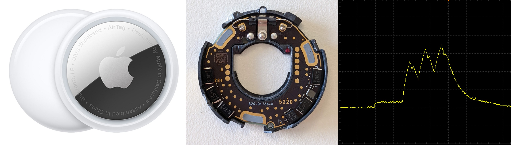
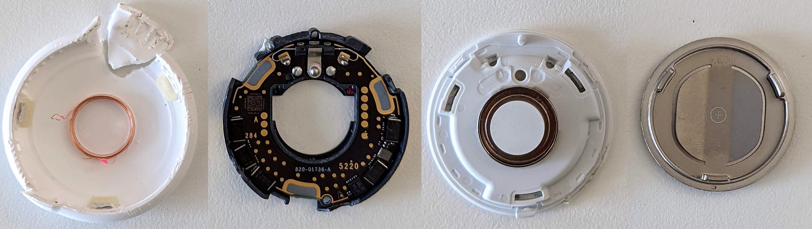
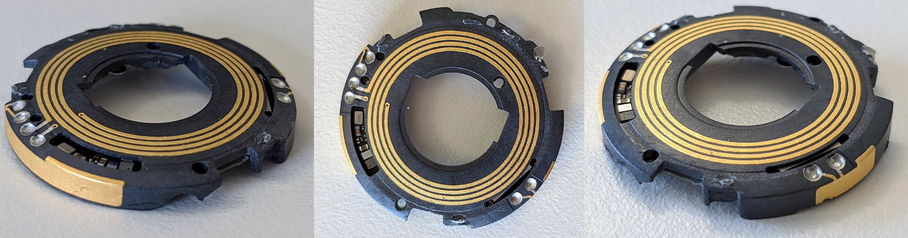
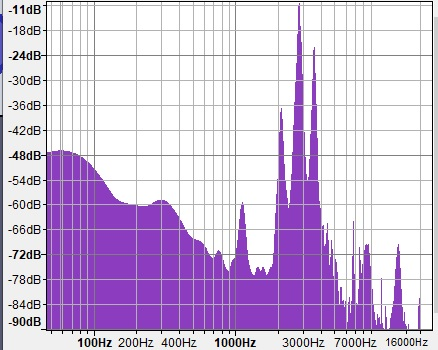

# Apple AirTag Reverse Engineering

This page serves as a central resource for technical details of the AirTag: hacks, security research, mofifications, teardowns and more. It is a combination of my work and publicly available information. It will be updated as more is discovered.

[Tweet me](https://twitter.com/adamcatley) or [view on GitHub](https://github.com/adamcatley/adamcatley.github.io/blob/master/docs/AirTag.md) to propose changes or corrections.



## Key Facts and Findings

- Uses **off the shelf** components, apart from Apple's U1 chip for UWB
- The popular **nRF52832** is used for BLE and NFC
- Sleep current consumption of **2.3µA** gives over 10 years of potential battery life
- Updates BLE address and public key **once a day** at 02:00 UTC
- Updates last byte of advertisement data every **15 minutes**
- Goes into a lost mode exactly **3 days** after being away from its owner's device
- Makes noise once every **6 hours** while in lost mode and movement is detected
- Samples the accelerometer every **10 seconds** when waiting for movement
- Samples the accelerometer every **0.5 seconds** once motion is detected, for **20 seconds**
- Transmits BLE advertisement every **2 seconds** when away from its owner's device
- BLE connection interval of **1 second** when near its owner's device
- nRF needs at least **~1.9V** battery voltage to boot up
- 32Mbit flash storage is **unencrypted**
- nRF programming interface (**SWD**) easily accessible via test pads

## Background Research

I started this investigation to learn about Apple's approach to electronics design and security in their latest products, especially at such a low price point ($29). I was particularly interested due to the similarities to my [Masters thesis](https://drive.google.com/file/d/0By4g-wZWsMlnaGg5S2JNRXRNWkk/view?usp=sharing) project in which I designed a small BLE device where battery life was also important.

The aspects that I wanted to investigate are:
- Hardware design to fit so much in a small enclosure (BLE, UWB, NFC, accelerometer, speaker, antennas) - [results](#hardware)
- Use of custom silicon vs "off the shelf" components - [results](#pcb-overview)
- Low energy design of hardware and software to maximise battery life - [results](#battery-life)
- Implementation of the [claimed privacy](#privacy-claims) features to avoid unwanted tracking - [results](#privacy)
- Usage of recent BLE privacy and security features - [results](#bluetooth)
- Hardware and firmware security of Apple products - [results](#security)
- What modifications are possible - [results](#mods)

This section contains the research I did about these topics before my AirTag arrived on release day (30/04/2021).

### Privacy Claims

From [this video](https://www.youtube.com/watch?v=DEbm2iG1TNU&t=120s):
>Bluetooth identifiers rotate several times a day.

Apple document the privacy features of the FindMy network in detail [here](https://support.apple.com/en-gb/guide/security/sec60fd770ba/web) and [here](https://support.apple.com/en-gb/guide/security/sece994d0126/web).

[](https://support.apple.com/en-gb/guide/security/sece994d0126/web)


### Supported devices

Support for the AirTag was introduced in iOS 14.5. Apple lists which iPhone, iPod Touch and iPad devices are supported [here](https://support.apple.com/en-gb/HT211348).

## Hardware 



### Teardown

There are several documented teardowns, listed in chronological order:
- [Apr 30] [@haruki_kawaiii](https://twitter.com/haruki_kawaiii/status/1388012416613507072)
- [Apr 30] My own [Twitter thread](https://twitter.com/adamcatley/status/1388196843184697346)
- [Apr 30] [DBrand](https://dbrand.com/shop/special-edition/teardown) skins ([front](https://dbrand.com/sites/default/files/dba/printed-skins-ppv/teardown/apple-airtag/sig_teardown-gloss_0.jpg), [back](https://dbrand.com/sites/default/files/dba/printed-skins-ppv/teardown/apple-airtag/sig_teardown-gloss_1.jpg) images)
- [May 3] [@tb69rr](https://twitter.com/tb69rr/status/1389183123234119680)
- [May 3] [iFixit](https://www.ifixit.com/News/50145/airtag-teardown-part-one-yeah-this-tracks) article (inlcuding x-ray [video](https://valkyrie.cdn.ifixit.com/media/2021/05/01153224/drill-xray-1.mp4) and high  quality [front](https://valkyrie.cdn.ifixit.com/media/2021/05/03133827/AirTags_33.jpg), [back](https://valkyrie.cdn.ifixit.com/media/2021/05/03133839/AirTags_48.jpg) images)
- [May 4] [JerryRigEverything](https://www.youtube.com/watch?v=5MaPqUYAetg) video
- [May 7] Colin O'Flynn [Twitter thread](https://twitter.com/colinoflynn/status/1390432081126297606) and related [blog post](https://colinoflynn.com/2021/05/apple-airtag-teardown-test-point-mapping/)

Removing the PCB is likely to cause damage due to the thin PCB and it being soldered to the plastic tray.

#### Revisions

The various teardowns reveal variations in the PCB markings in the top copper layer. This will be useful if it is determined that early production runs didnt enable all security features to lock down the units.

The bottom right numbers look like a manufacturing data code (eg. "2920 17" could be the 29th week of 2020, batch 17). From the available samples:
- US devices are in the range `2920, 3020, 3120`
- Europe is `5220`, a few months later
- Asia is `1021`, a few months later and only a few weeks befor launch

There is also a letter to the left of the 3 big pads on the left. This could relate to the U1 chip underneath
- This is either `A` (Europe) or `C` (rest of world). `A` also comes with a 3 digit number, C does not.

A constant value `820-01736-A` is on the silkscreen layer and looks like Apple's internal part number and revision (`A`) for the PCB.

More samples are needed to understand better.

### PCB Overview

[](https://www.ifixit.com/News/50145/airtag-teardown-part-one-yeah-this-tracks)

*Annotated diagram coming soon*

- nRF52832
- GD25LE32D 32Mbit NOR flash
- MAX98357AEWL audio amp 
- TPS62746 DC buck
- TLV9001IDPWR opamp
- BMA280 accelerometer

#### Test points

[](https://github.com/colinoflynn/airtag-re/blob/master/images/frontside-tpnames.jpg)

Colin O'Flynn has helpfully [documented](https://github.com/colinoflynn/airtag-re/blob/master/README.md) the test points on the top side of the PCB.

### Antennas

There are three antennas inside the AirTag:

1. Bluetooth Low Energy (left) - 2.4GHz
2. NFC (middle) - 13.56MHz
3. Ultra Wideband (right) - 6.5-8GHz

They are all etched onto a single piece of plastic using Laser Direct Structuring (LDS) and then soldered to the PCB around the edge. The NFC antenna also has a short trace on the other side of the plastic (connected with a via at each end) to return the inside end of the coil to the PCB.



### Speaker

The voice coil is glued to the outer plastic shell which acts as a diaphragm. Due to the fixed magnet it moves back and forth when the coil is energised, producing sound to act as the speaker.

The AirTag operates the same whether the voice coil is connected or not.

After 3 days of being away from its ownder's device, the speaker will make a loud beep if motion is detected, for a maximum of 20 seconds of motion. It will then stay silent for the next 6 hours until waiting for motion again.

Playing sound uses >3000x more power than being asleep, arond 8mA, even without a voice coil attached. This is perhaps because the nRF has to rapidly update the DAC with audio samples. Here current (yellow) is plotted in sync with the corresponding sound wave (blue) while playing the lost AirTag noise:


### Flash storage

The SPI flash can be accessed by following [this guide](https://colinoflynn.com/2021/05/apple-airtag-teardown-test-point-mapping/).

### Power

There are 2 positive battery terminals. Both need 3V to power the AirTag.

There are 5 100uF capacitors around the edge of the top side of the PCB. They keep the device powered up for several seconds with the battery removed. This likey helps with the [reset procedure](https://support.apple.com/en-gb/HT212251#:~:text=repeat%20the%20process%20four%20more%20times,%20removing%20and%20replacing%20the%20battery) of removing the battery 5 times in short succession.

## Theory of Operation

TODO

### Architecture

TODO

### States

TODO

## Wirelss Communication

### Bluetooth LE

The nRF52832 supports BLE 5.2.

#### Advertising data

This section describes the Bluetooth activity when the AirTag is registered to the FindMy network. 

- Address type: Random Static (changes daily)
- Advertising PDU type: Connectable undirected (ADV_IND)
- Advertising period: 2000ms
- Advertising tramsmit time: 4ms (including wake up)

Byte #|Value|Description
:-:|-|-
0|0x1E|Advertising data length: 31 (the maximum allowed)
1|0xFF|Advertising data type: Manufacturer Specific Data
2-3|0x004C|Apple's [company identifier](https://www.bluetooth.com/specifications/assigned-numbers/company-identifiers/)
4|0x12|Apple payload type to indicate a FindMy network broadcast?
5|0x19|Apple payload length (31 - 6 = 25 = 0x19)
6|0x10|FindMy device type to indicate an AirTag? (0x00 seen from other Apple devices)
7-29|Varies|Assumed to be P-224 public key used by FindMy network. Changes daily
30|0-3|Status flags and/or ECC public key [odd/even bit](https://cryptobook.nakov.com/asymmetric-key-ciphers/elliptic-curve-cryptography-ecc#public-key-compression-in-the-elliptic-key-cryptosystems)?
31|Varies|Crypto counter value? Changes every 15 minutes to a random value

According to Apple's [documentation](https://support.apple.com/en-gb/guide/security/sece994d0126/1/web/1#:~:text=P-224%20public%20key%20Pi%20obtained%20from%20the%20Bluetooth%20payload), the BLE advertising data should contain a NIST P-224 public key. This key would be at least 28+1 bytes long but only 23+1 bytes in the advertising data ever change. The other 5 bytes are cleverly used as the device's Bluetooth address. This is how Apple fits a public key in a single BLE packet. As demonstrated [here](https://github.com/seemoo-lab/openhaystack/blob/ffc5170ea4b4ceb1ad84e4f89324d6e666ffc7c3/Firmware/ESP32/main/openhaystack_main.c#L107).

Apple presumably uses authentication to stop non-Apple devices connecting to the AirTag, as connections are terminated by the AirTag shortly after connecting. This could be investigated further to add some kind of Android support, although an Apple ID is needed to benefit from the FindMy network.

#### Unregistered behaviour

When the AirTag is not registered to the FindMy network, it has similar behaviour but advertises using its default device address at 33ms intervals, and with a different Apple payload. 

Byte #|Value|Description
:-:|-|-
0|0x1E|Advertising data length: 31 (the maximum allowed)
1|0xFF|Advertising data type: Manufacturer Specific Data
2-3|0x004C|Apple's [company identifier](https://www.bluetooth.com/specifications/assigned-numbers/company-identifiers/)
4|0x07|Apple payload type to indicate a FindMy device?
5|0x19|Apple payload length (31 - 6 = 25 = 0x19)
6-31|Varies|Not investigated yet

### UWB

Uses Apple's custom U1 chip.

Looks different to the U1 seen in other Apple devices such as [iPhone 11](https://www.ifixit.com/News/33257/inside-the-tech-in-apples-ultra-wideband-u1-chip).

From the FCC [test report](https://fccid.io/BCGA2187/Test-Report/12791034-E2V3-FCC15-519-Final-Report-5130980):
- UWB Channel 5 (6.5GHz) and 9 (8GHz)
- 500MHz Bandwidth
- BPSK
- 1 antenna

Currently untested.

### NFC

The AirTag uses the [NFC-A peripheral](https://infocenter.nordicsemi.com/index.jsp?topic=%2Fcom.nordic.infocenter.nrf52832.ps.v1.1%2Fnfc.html) of the nRF52832 to implement an NXP MIFARE Plus (Type 4) tag in read only mode.  The NFC antenna is located behind the white cover, as shown [above](#antennas).

NFC is used to allow anyone who finds an AirTag to potentially identify the owner, even if they have an Android device. Apple describes the process [here](https://support.apple.com/en-gb/HT212227#:~:text=If%20you%20find%20an%20AirTag%20or%20a%20lost%20item%20with%20an%20AirTag%20attached).

The tag can only be read when the AirTag is powered by a battery. It simply contains a URL to uniquely identify the AirTag, depending on its current state.

#### Unregistered
When the AirTag is brand new, has been [reset](https://support.apple.com/en-gb/HT212251#:~:text=repeat%20the%20process%20four%20more%20times,%20removing%20and%20replacing%20the%20battery), or has been [removed](https://support.apple.com/en-in/guide/iphone/iph869abb075/ios) from the FindMy network, the URL stored on the tag is fixed and the values do not change. It follows the following format:

```
https://found.apple.com/airtag?pid=5500&b=00&pt=004c&fv=00100e10&dg=00&z=00&bt=A0B1C2D3E4F5&sr=ABCDEF123456&bp=0015
```

Parameter | Value | Description
:-:|-|-
pid|5500|Product ID for AirTag?
b|00|Battery related?
pt|004c|UWB Precision tracking/Finding version?
fv|00100e10|Firmware version?
dg|00|Diagnostic code?
z|00|Unknown
bt|XXXXXXXXXXXX|Default Bluetooth address (hexadecimal)
sr|XXXXXXXXXXXX|Serial number of tag (alphanumeric)
bp|0015|Bluetooth protcol version?

While this data uniquely identifies the AirTag, it uses identifiers you would have access to if you were near enough to read NFC (<10cm) before the device is registered:
- The device's Bluetooth address `bt` is also used for broadcasts in this state (so could be captured by someone nearby during setup). 
- The serial number `sr` is not a secret. It is printed on the device under the battery (and on a sticker on the device packaging). It is also revealed by visiting the URL itself. Apple explain this [here](https://support.apple.com/en-gb/HT211658).

Apple's servers accept any combination of values and parameter names. The only one used is `sr` and it can be empty. See [here](https://found.apple.com/airtag?sr=).
```
https://found.apple.com/airtag?sr=
```

I don't yet have another AirTag to compare the values across different devices. For a single unit the values are persistent across power cycles, long runtime, resets and modes.

#### Registered

When the AirTag has been registered to the FindMy network with an iOS device, the tag URL changes slightly to the following format:

```
https://found.apple.com/airtag?pid=5500&b=00&pt=004c&fv=00100e10&dg=00&z=00&pi=793f8d9fccaa91c3c177f32acf47160656873168d72f070cd925ce97
```

Parameter | Value | Description
:-:|-|-
pid|5500|Product ID for AirTag?
b|00|Battery related?
pt|004c|UWB Precision tracking/Finding version?
fv|00100e10|Firmware version?
dg|00|Diagnostic code?
z|00|Unknown
pi|Varies |Public identity (224 bits long)

In summary, the parameters `bt`, `sr` and `bp` have been removed and replaced with a single **anonymous** identifier, `pi` (not to be confused with `pid`).

`pi` is the only parameter that changes. It is updated at least every 15 minutes when the Bluetooth address and/or the advertising data changes. It is likely the current P-224 public key, or a SHA-224 hash of the key. It does not match the BLE advertising data which should contain the public key.

Again, most parameters are optional. The only requirement is that `pi` is valid. 

Apple servers can somehow connect this to a specific device as the page shows the corresponding serial number (maybe even before the AirTag has been registered) as well as the owner's lost message and phone number if available. Apple claims to not store any information about the AirTags and only the owner's phone and the AirTag can generate their rotating public keys.

The firmware function that generates this URL has been [identified](https://twitter.com/ghidraninja/status/1390639514134237186) by [@ghidraninja](https://twitter.com/ghidraninja). Further reverse engineering could reveal the meaning of the unknown URL parameters set by that function.

[](https://twitter.com/ghidraninja/status/1390639514134237186)

## Battery Life

The AirTag is supplied with a CR2032 Lithium coin cell from Panasonic. This has a nominal capacity and voltage of 225mAh and 3V.


I measure a 2.3µA load on the battery while the AirTag is idle. The [datasheet](https://industrial.panasonic.com/cdbs/www-data/pdf2/AAA4000/AAA4000C321.pdf) shows the expected capacity with such a small load to be almost the whole 225mAh. The AirTag will power up from a supply of at least 2V, which works well with the cell's cut off voltage of 2.0V.

This gives a **maximum battery life of at least 11 years** if the device never came out of sleep.

Achieving a sleep current of 2.3µA is impressive given the nRF52832 alone uses 1.9µA (at 1.8V) while asleep with RTC running, according to its datasheet. This means the rest of the circuitry is designed to be very efficient, minimise leakage and actively shut down or remove power from unused components such as the U1 and flash.

### Energy traces

The current consumption for many of the AirTag's wake up events have been captured and will be added here soon. You can see a preview of the BLE advertisement event at the top of the page.

TODO

## Privacy

The Bluetooth address only changes once a day (at 2am UTC). Further, only the last of the 31 advertisement bytes changes during the day. This makes it easy to track anyone unknowingly carrying an AirTag for the rest of their daily routine (eg to their home).

There also seems to be a way to predict part of the future Bluetooth address, but this needs more investigation.

The AirTag seems perfectly happy to operate as normal wihout the voice coil connected. This seems to be poor protection for the part of Apple's privacy claims that involve making a sound to notify nearby people they may be being tracked.

## Security

### Assets

TODO

### nRF52832

The nRF52832 has Access Port Protection (APPROTECT). This disables access to the Debug Port through SWD and prevents reading out the internal flash. Colin O'Flynn has [confirmed](https://twitter.com/colinoflynn/status/1390499614860644355) that AirTags do enable this security feature.

However, it is known that this protection is vulnerable to side channel attacks and can be bypassed on all nRF52 devices through voltage glitching as described [here](https://limitedresults.com/2020/06/nrf52-debug-resurrection-approtect-bypass/). 

We can assume Apple are aware of this exploit as it was disclosed in Q2 2020. This would have been towards the end of the development cycle for the AirTag so it is unclear if/how Apple addresed this risk. 

The privacy mechanism used by FindMy devices uses well documented cryptography and so is not dependant on confidentiality of the firmware. However, it would be possible to disable other privacy features that Apple advertise, or run completely custom firmware.

### Apple U1 

Very little is known about this custom chip designed by Apple.

It likely contains a processor as the flash chip [contains](https://twitter.com/ghidraninja/status/1390609884316635138) 64-bit ARM instructions that the nRF52832 does not support (discovered by [@ghidraninja](https://twitter.com/ghidraninja)).

### Flash

The 32Mbit NOR Flash is [not encrypted](https://twitter.com/ghidraninja/status/1390619216823390208) and contains several assets. It is yet to be confirmed where/if the public/private key pair is stored.

## Mods

### Smallest form factor

>Is is possible to make the AirTag even smaller to put it inside other devices? 

The other device's battery could be used for power, and the device casing be used as a diaphragm for the speaker by attaching the voice coil.

The stock dimensions are **31.9mm diameter and 8.0mm height**.

The smallest dimensions possible while retaining funtionality is **26mm diameter and 3mm height**.


### Change sounds

> Can the sounds the AirTag makes during statup and when lost be changed?

Need to investigate if raw audio files are used (and where they're stored), or generated live programmatically. 

The startup sound ([example](https://www.youtube.com/watch?v=vniKeX-O2Xk)) is made of a few frequencies around 3kHz. Spectrum:



*This page is a work in progress...*
